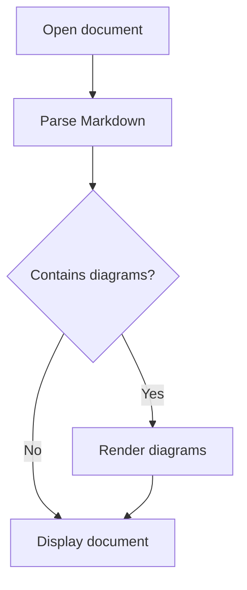
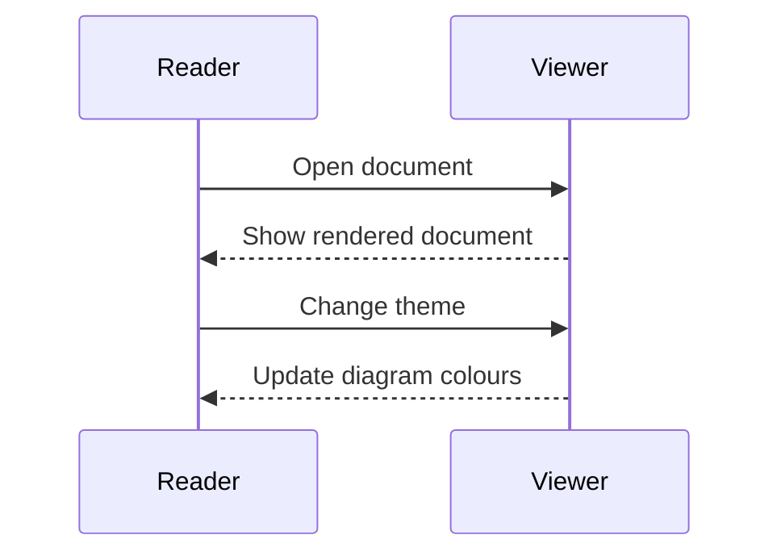

# Mermaid diagrams

## Flowchart


```mermaid
flowchart TD
    Start[Open document] --> Parse[Parse Markdown]
    Parse --> Check{Contains diagrams?}
    Check -->|Yes| Render[Render diagrams]
    Check -->|No| Display[Display document]
    Render --> Display
```

## Sequence diagram


```mermaid
sequenceDiagram
    participant Reader
    participant Viewer
    Reader->>Viewer: Open document
    Viewer-->>Reader: Show rendered document
    Reader->>Viewer: Change theme
    Viewer-->>Reader: Update diagram colours
```

## Ordinary code

```javascript
const message = "Hello, world!";
console.log(message);
```
